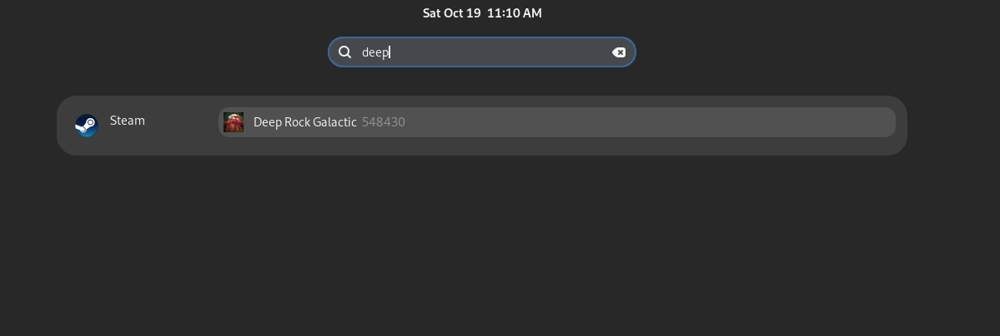

# Steam Search Provider for GNOME Shell

This is a GNOME search provider for searching games in your steam library.



## Install

### From Source

```bash
# Install rust and dependencies
# ex. Fedora

sudo dnf install rust glib2-devel

# Build

make

# Install

sudo make install
```

### Enable

Open the GNOME search settings and enable the Steam search provider.

## License

Distributed under the GNU GPLv3 License. See `LICENSE` for more information.
